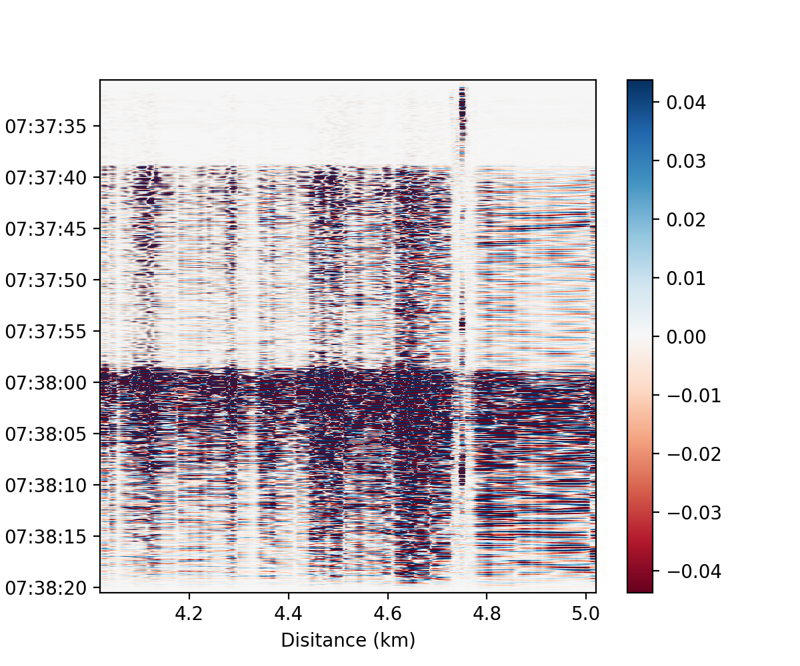

&emsp;


## DASPy

DASPy is an open-source project dedicated to provide a python package for DAS (Distributed Acoustic Sensing) data processing.

The goal of the DASPy project is to lower the bar of DAS data processing. DASPy includes:
* Classic seismic data processing techniques, including preprocessing, filter, spectrum analysis, and visualization
* Specialized algorithms for DAS applications, including denoising, waveform decomposition, channel attribute analysis, and strain-velocity conversion. 

DASPy is licensed under the MIT License. [An English version of DASPy tutorial](https://daspy-tutorial.readthedocs.io/en/latest/), [a Chinese version of DASPy tutorial](https://daspy-tutorial-cn.readthedocs.io/zh-cn/latest/) and [a Jupyter notebook example](document/example.ipynb) is available. If you have any questions, please contact me via <hmz2018@mail.ustc.edu.cn>.

## Installation
DASPy runs on Linux, Windows and Mac OS and on Python 3.9 and up.

### Pip
```
pip install daspy-toolbox
```

Install the latest version from GitHub:

```
pip install git+https://github.com/HMZ-03/DASPy.git
```

### Conda

```
conda install daspy-toolbox
```

or

```
conda install conda-forge::daspy-toolbox
```

### Manual installation
1. Install dependent packages: numpy, scipy >=1.13, matplotlib, geographiclib, pyproj, h5py, segyio, nptdms, tqdm

2. Add DASPy into your Python path.

## Getting started
```
from daspy import read
sec = read()  # load example waveform
sec.bandpass(1, 15)
sec.plot()
```


### Contributing

Please see details on how to contribute to the project [here](CONTRIBUTING.md) and [here](CodingStyleGuide.md).

### Reference

  * Minzhe Hu and Zefeng Li (2024), [DASPy: A Python Toolbox for DAS Seismology](https://pubs.geoscienceworld.org/ssa/srl/article/95/5/3055/645865/DASPy-A-Python-Toolbox-for-DAS-Seismology), *Seismological Research Letters*, 95(5), 3055–3066, doi: `https://doi.org/10.1785/0220240124`.
