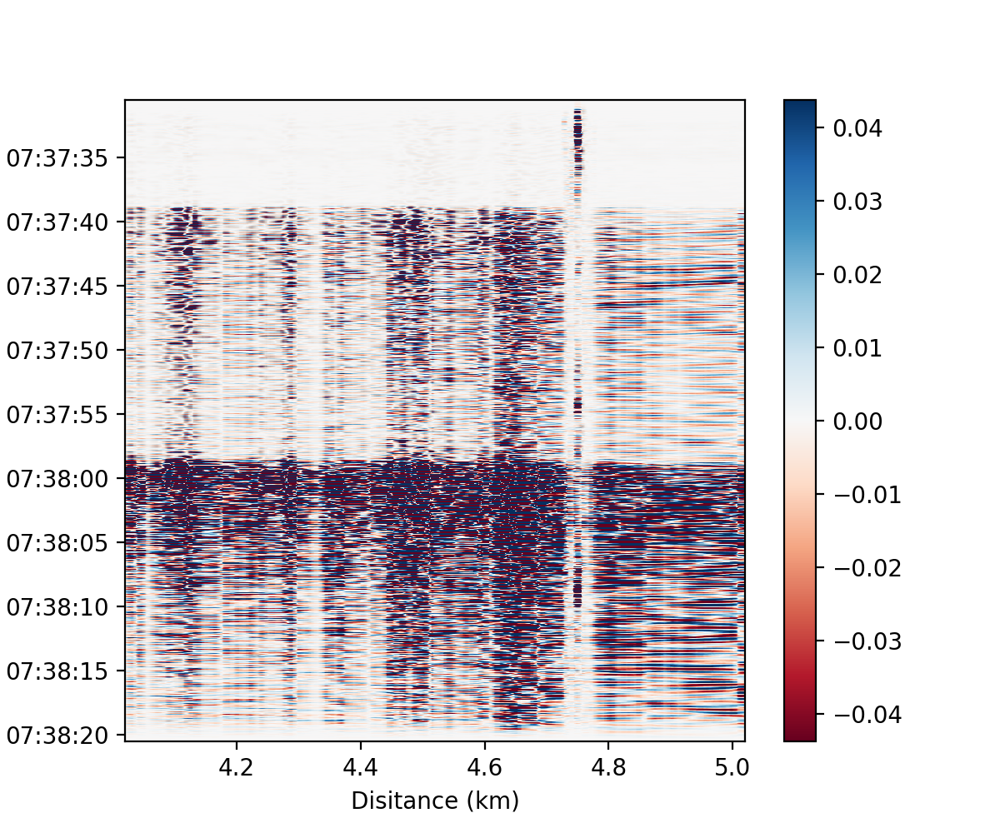

[](https://pypi.org/project/DASPy-toolbox/)
[](https://opensource.org/license/mit)
[](https://pypi.org/project/DASPy-toolbox/)
[](https://doi.org/10.1785/0220240124)
[](https://pypi.org/project/DASPy-toolbox/)
[](https://anaconda.org/conda-forge/daspy-toolbox)

# DASPy

DASPy is an open-source Python package for **Distributed Acoustic Sensing (DAS)**
data processing.

The project aims to lower the barrier for DAS processing and to provide a
practical toolkit for DAS seismology workflows.

## Features

DASPy includes:

- **Classic seismic processing**: preprocessing, filtering, spectral analysis,
  and visualization.
- **DAS-oriented algorithms**: denoising, wavefield decomposition, channel
  analysis, and strain-velocity conversion.
- **Convenient data structures**: `Section`, `Collection`, and `DASDateTime`
  for waveform, continuous acquisition, and time handling workflows.

## Documentation

- English tutorial: <https://daspy-tutorial.readthedocs.io/en/latest/>
- 中文教程: <https://daspy-tutorial-cn.readthedocs.io/zh-cn/latest/>
- Example notebook: [`document/example.ipynb`](document/example.ipynb)

## Installation

DASPy supports **Python 3.9+** on Linux, macOS, and Windows.

### pip

Install from PyPI:

```bash
pip install daspy-toolbox
```

Install the latest development version:

```bash
pip install git+https://github.com/HMZ-03/DASPy.git
```

### conda

```bash
conda install conda-forge::daspy-toolbox
```

If you are using Python 3.13 or later, installation through conda may fail
because `segyio` is not yet available for all conda-forge builds. In that case,
use `pip` or Python 3.12 and earlier.

### Manual installation

1. Install dependencies: `numpy`, `scipy>=1.13`, `matplotlib`,
   `geographiclib`, `pyproj`, `h5py`, `segyio`, `nptdms`, `tqdm`.
2. Add DASPy to your Python path, or install it in editable mode:

```bash
git clone https://github.com/HMZ-03/DASPy.git
cd DASPy
pip install -e .
```

## Quick start

```python
from daspy import read

sec = read()  # load the built-in example waveform
sec.bandpass(1, 15)
sec.plot()
```



## Contributing

Contributions are welcome. Please see [CONTRIBUTING.md](CONTRIBUTING.md).

## Reference

- Minzhe Hu and Zefeng Li (2024),
  [DASPy: A Python Toolbox for DAS Seismology](https://pubs.geoscienceworld.org/ssa/srl/article/95/5/3055/645865/DASPy-A-Python-Toolbox-for-DAS-Seismology),
  *Seismological Research Letters*, 95(5), 3055–3066,
  doi: `https://doi.org/10.1785/0220240124`.

## Contact

If you have questions, please contact <hmz2018@mail.ustc.edu.cn>.
